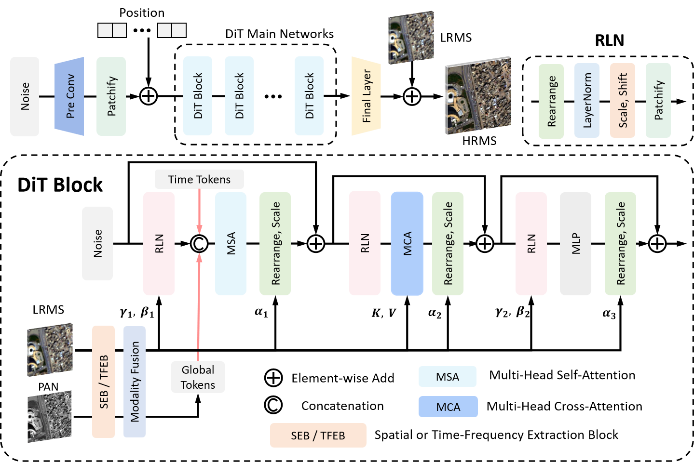

# PanDiT

## Build environment
```
conda create -n PanDiT python==3.11
conda activate PanDiT
pip install -r requirements.txt
```
## Train
```
python train.py --dataset_name GF2 --train_dataset_folder path_to_train_dataset --valid_dataset_folder path_to_valid_dataset
```
## Test
```
python predict.py --dataset_folder path_to_test_dataset --save_dir path_to_save --weight_path path_to_model_weight --mode CMYK 
```